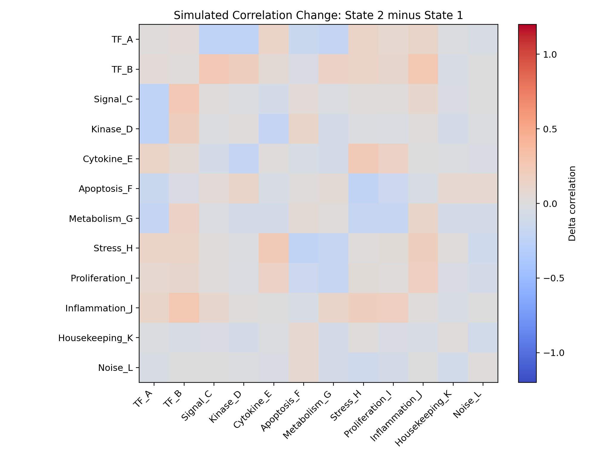
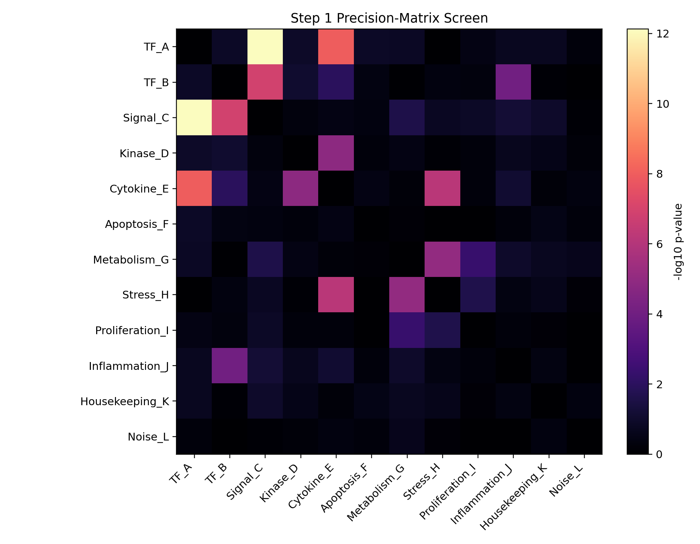
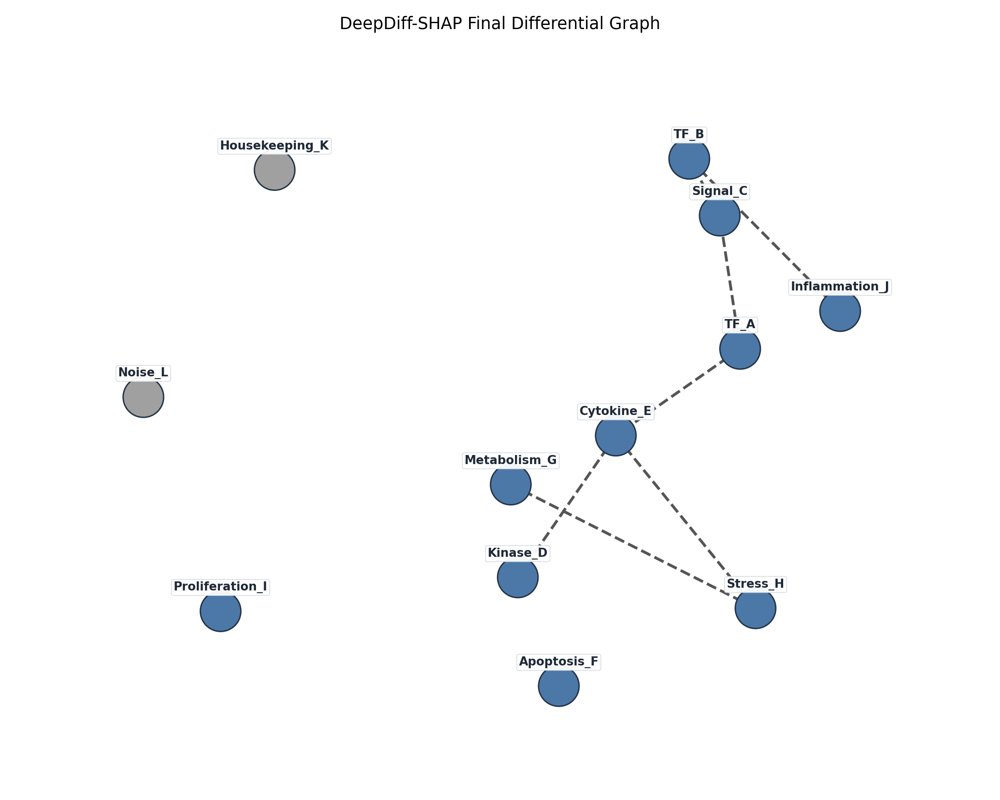
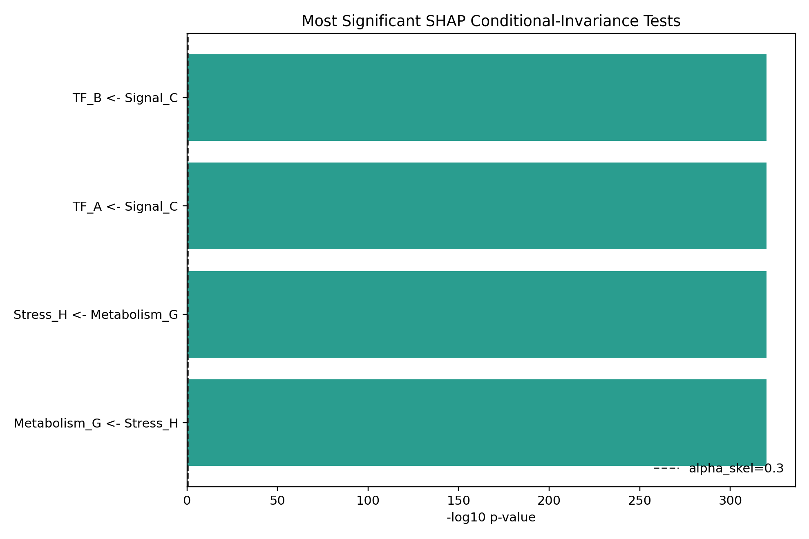
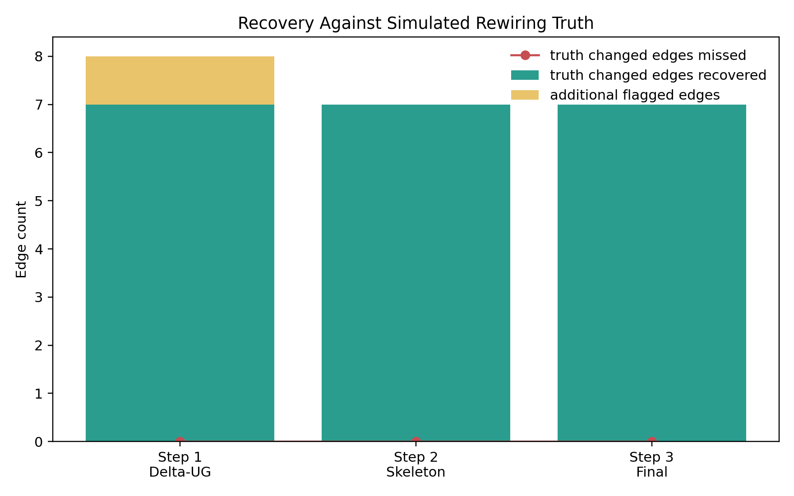

# DeepDiff-SHAP Simulated Gene-Expression Run

## Objective

I ran the DeepDiff-SHAP pipeline on simulated normalized gene-expression data rather than tabular EHR data. The simulation uses two equal-sized states with a known regulatory rewiring pattern, which is a reasonable analog for differential gene co-regulation across disease states, treatment states, or cell-state strata.

The run follows the repo/paper setup: precision-matrix screening, SHAP-based conditional invariance pruning, and DNN residual-variance orientation.

## Simulation Design

- Samples per state: 240
- Features: 12 standardized log-expression-like gene measurements
- State 1: TF_A drives Signal_C; Signal_C propagates through Kinase_D, Cytokine_E, Metabolism_G, and Stress_H.
- State 2: TF_B takes over Signal_C, Cytokine_E rewires Stress_H, and Inflammation_J gains a TF_B/nonlinear interaction component.
- Known changed undirected regulatory edges: 7
- Standardization: each state was z-scored separately, matching the repository example's subgroup preprocessing pattern.

## Parameters

| Parameter | Value |
| --- | ---: |
| alpha_ug | 0.005 |
| alpha_skel | 0.3 |
| alpha_orient | 0.001 |
| max conditioning set size | 1 |
| SHAP samples per state/test | 160 |
| SHAP background samples | 40 |
| DNN epochs | 35 |

## Results Summary

| Stage | Edges | Simulated truth edges recovered |
| --- | ---: | ---: |
| Step 1 Delta-UG | 8 | 7 / 7 |
| Step 2 SHAP skeleton | 7 | 7 / 7 |
| Step 3 final graph | 7 | 7 / 7 |

Step 1 was appropriately sensitive for the simulated expression rewiring and included one additional indirect edge. The SHAP pruning stage removed that extra edge, leaving a final graph that matched the known rewired gene-gene relationships in this controlled simulation.

## Final Differential Graph

- TF_A -- Signal_C remained unoriented.
- TF_A -- Cytokine_E remained unoriented.
- TF_B -- Signal_C remained unoriented.
- TF_B -- Inflammation_J remained unoriented.
- Kinase_D -- Cytokine_E remained unoriented.
- Cytokine_E -- Stress_H remained unoriented.
- Metabolism_G -- Stress_H remained unoriented.

Accepted residual-invariance orientations: 0

## Top Step 1 Precision-Screen Hits

| Edge | p-value | In Delta-UG |
| --- | ---: | --- |
| TF_A -- Signal_C | 7.471e-13 | True |
| TF_A -- Cytokine_E | 1.000e-08 | True |
| TF_B -- Signal_C | 1.235e-07 | True |
| Cytokine_E -- Stress_H | 6.328e-07 | True |
| Metabolism_G -- Stress_H | 8.724e-06 | True |
| Kinase_D -- Cytokine_E | 1.351e-05 | True |
| TF_B -- Inflammation_J | 8.946e-05 | True |
| Metabolism_G -- Proliferation_I | 4.658e-03 | True |
| TF_B -- Cytokine_E | 1.121e-02 | False |
| Stress_H -- Proliferation_I | 2.345e-02 | False |

## Top SHAP Conditional-Invariance Tests

| Direction | Conditioning genes | p-value | Removed |
| --- | --- | ---: | --- |
| TF_B <- Signal_C | TF_A | 1.000e-320 | False |
| TF_A <- Signal_C | TF_B | 1.000e-320 | False |
| Stress_H <- Metabolism_G | Inflammation_J | 1.000e-320 | False |
| Metabolism_G <- Stress_H | Inflammation_J | 1.000e-320 | False |
| Stress_H <- Metabolism_G | Proliferation_I | 1.000e-320 | False |
| Metabolism_G <- Stress_H | Proliferation_I | 1.000e-320 | False |
| Stress_H <- Metabolism_G | Cytokine_E | 1.000e-320 | False |
| Metabolism_G <- Stress_H | Cytokine_E | 1.000e-320 | False |
| Stress_H <- Metabolism_G | Kinase_D | 1.000e-320 | False |
| Metabolism_G <- Stress_H | Kinase_D | 1.000e-320 | False |

## Figures

## Interpretation

The simulated expression system was intentionally constructed with regulatory rewiring rather than mean shifts. Because each subgroup was standardized separately, the signal available to DeepDiff-SHAP is mostly correlation and conditional-dependence structure. This mirrors how the method would be used on normalized gene-expression matrices from two biological states.

In this run, the method detected the largest state-specific regulatory changes in the precision-screen stage and narrowed them through SHAP. The final retained graph matched the simulated rewiring truth, while the orientation stage did not accept any directions under the conservative `alpha_orient=0.001` residual-invariance threshold.

## Caveats

- This is a synthetic validation run, so the recovered edges are best read as a sanity check that the pipeline can process continuous gene-expression-like data.
- KernelSHAP is computationally expensive; I used a small expression panel and 160 samples per SHAP test to keep the run tractable on the local machine.
- The original repository script is notebook-export style and executes the diabetes example at top level, so this experiment uses a separate runner that preserves the same core pipeline stages while avoiding the EHR data fetch.
